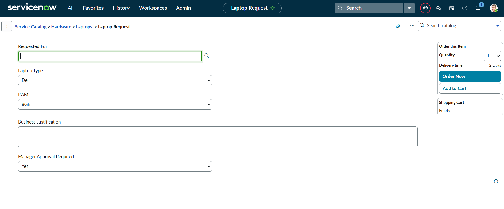
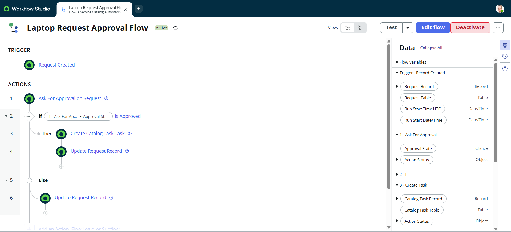
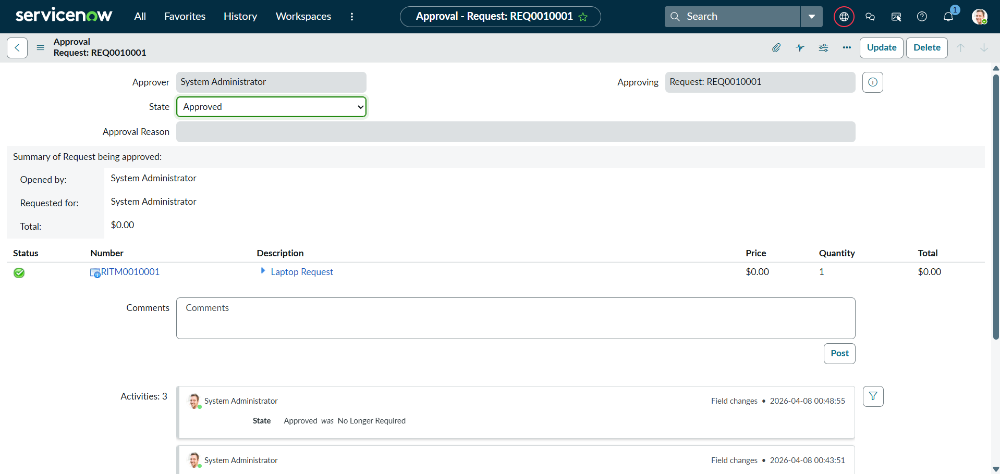
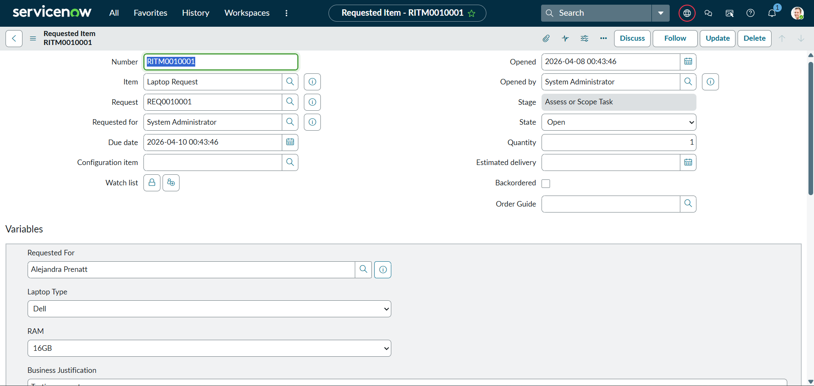
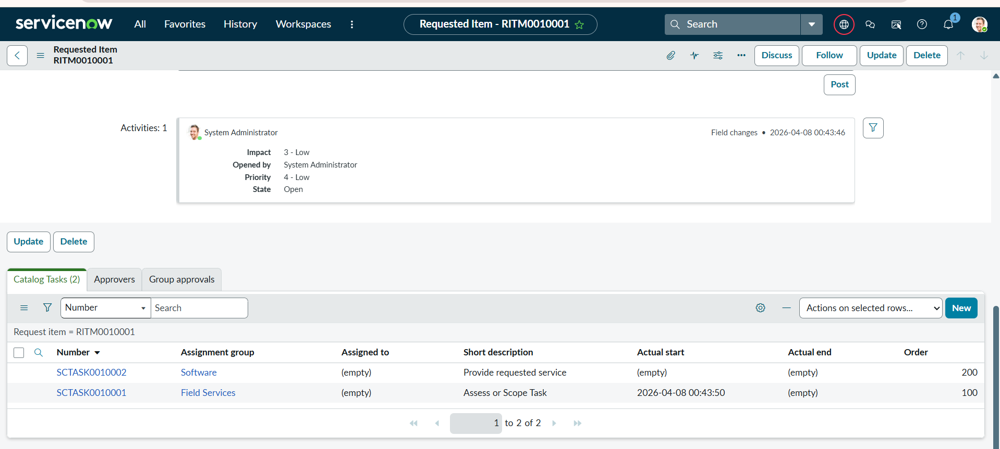

## 🚀 ServiceNow Service Catalog + Approval Workflow Automation

---

### 📌 Project Overview

This project demonstrates an end-to-end ServiceNow automation solution using Service Catalog and Flow Designer.

Users can request a laptop through a catalog item, which triggers an approval workflow. Upon approval, tasks are automatically created for the IT team to fulfill the request.

---

### 🎯 Key Features
- Service Catalog Item (Laptop Request)
- Automated Approval Workflow
- Flow Designer Implementation
- Task Creation (Catalog Task)
- Status Management (Approved/Rejected)

---

### 🛠️ Technologies Used
- ServiceNow Platform
- Flow Designer
- Service Catalog
- Catalog Task (sc_task)
- Request Tables (sc_request, sc_req_item)

---

### ⚙️ Workflow Explanation
### Step 1: User Request
User submits a laptop request via Service Catalog.

### Step 2: Approval Workflow
Request is sent to approver (System Administrator/Manager).

### Step 3: Decision Logic
- If Approved → Task is created
- If Rejected → Status updated

### Step 4: Task Creation
Catalog task is automatically assigned to IT team.

---

### 📸 Screenshots
### 🔹 Catalog Item Form

### 🔹 Flow Designer

### 🔹 Approval Process

### 🔹 Requested Item (RITM)

### 🔹 Catalog Task Created

---

### ⚙️ Workflow Explanation
1. User submits a Laptop Request through Service Catalog
2. Request is created in sc_request and sc_req_item
3. Flow Designer triggers automatically when request is created
4. Approval request is sent to System Administrator
5. If approved → Catalog Task (sc_task) is created
6. If rejected → Request status is updated to Rejected

---

### 🔄 Flow Logic
- Trigger: Record Created on Request (sc_request)
- Step 1: Ask for Approval
- Condition:
 - If Approved → Create Catalog Task
 - If Rejected → Update Request Status

---

### 🗄️ Tables Used
- sc_request → Stores overall request
- sc_req_item → Stores requested item details
- sc_task → Stores tasks for fulfillment

---

### 📚 Key Learnings
- Gained hands-on experience with ServiceNow Flow Designer
- Understood Service Catalog lifecycle and workflow automation
- Implemented approval-based automation using conditional logic
- Learned integration between ServiceNow tables and processes
- Improved understanding of real-world IT service management workflows

---

### 🎤 Interview Explanation

"I developed a ServiceNow Service Catalog solution where users can request laptops. The request triggers an approval workflow using Flow Designer, and upon approval, catalog tasks are automatically created for the IT team to fulfill the request. This project demonstrates automation of real-world business processes in ServiceNow."

---

### 🚀 Future Enhancements
- Dynamic Manager Approval
- Assignment Groups instead of individual users
- SLA Integration
- Email Notifications
- Integration with CMDB

---

### ✅ Conclusion

This project demonstrates a real-world implementation of ServiceNow Service Catalog automation. It improves operational efficiency by reducing manual effort and automating request processing, approval, and task creation.

---

### 👩‍💻 Author
Gauravi Thakur
:::

